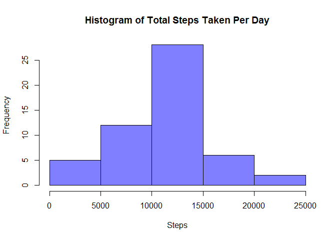
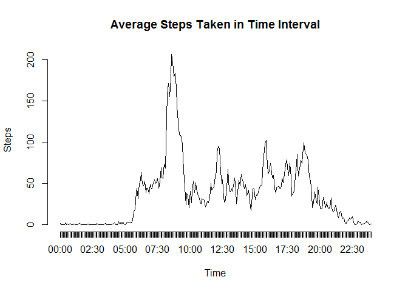
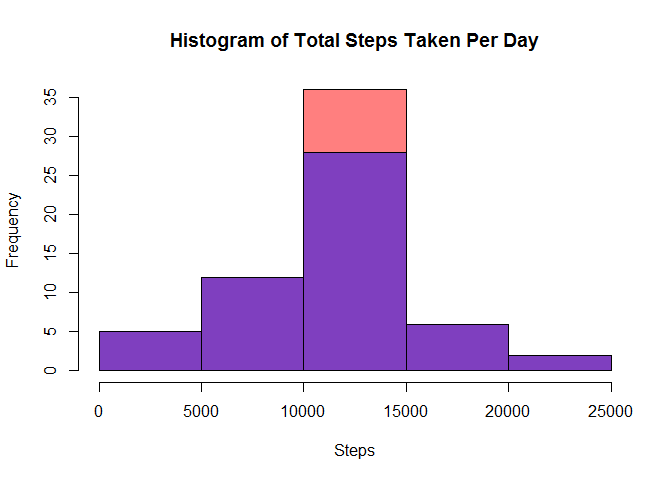
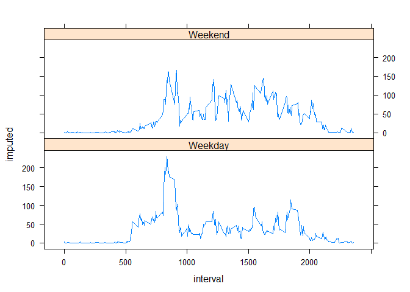

# Reproducible Research: Peer Assessment 1

```r
library(knitr)
opts_chunk$set(echo = TRUE, results = "hide")
#Disable scientific notation.  Round decimals to two digits
options(scipen = 999, digits = 2)
```


## Loading and preprocessing the data

Read the CSV file

```r
activity <- read.csv(unz("activity.zip", "activity.csv"), header = TRUE, na.strings="NA") #stringsAsFactors = FALSE)
activity[,2] <- as.Date(activity[,2]) 
```

## What is mean total number of steps taken per day?
Calculate total number of steps taken per day and provide histogram:

```r
totalPerDay <- aggregate(steps~date, data=activity, FUN=sum)
totalPerDay
```

```
##          date steps
## 1  2012-10-02   126
## 2  2012-10-03 11352
## 3  2012-10-04 12116
## 4  2012-10-05 13294
## 5  2012-10-06 15420
## 6  2012-10-07 11015
## 7  2012-10-09 12811
## 8  2012-10-10  9900
## 9  2012-10-11 10304
## 10 2012-10-12 17382
## 11 2012-10-13 12426
## 12 2012-10-14 15098
## 13 2012-10-15 10139
## 14 2012-10-16 15084
## 15 2012-10-17 13452
## 16 2012-10-18 10056
## 17 2012-10-19 11829
## 18 2012-10-20 10395
## 19 2012-10-21  8821
## 20 2012-10-22 13460
## 21 2012-10-23  8918
## 22 2012-10-24  8355
## 23 2012-10-25  2492
## 24 2012-10-26  6778
## 25 2012-10-27 10119
## 26 2012-10-28 11458
## 27 2012-10-29  5018
## 28 2012-10-30  9819
## 29 2012-10-31 15414
## 30 2012-11-02 10600
## 31 2012-11-03 10571
## 32 2012-11-05 10439
## 33 2012-11-06  8334
## 34 2012-11-07 12883
## 35 2012-11-08  3219
## 36 2012-11-11 12608
## 37 2012-11-12 10765
## 38 2012-11-13  7336
## 39 2012-11-15    41
## 40 2012-11-16  5441
## 41 2012-11-17 14339
## 42 2012-11-18 15110
## 43 2012-11-19  8841
## 44 2012-11-20  4472
## 45 2012-11-21 12787
## 46 2012-11-22 20427
## 47 2012-11-23 21194
## 48 2012-11-24 14478
## 49 2012-11-25 11834
## 50 2012-11-26 11162
## 51 2012-11-27 13646
## 52 2012-11-28 10183
## 53 2012-11-29  7047
```

```r
hist(totalPerDay$steps, main="Histogram of Total Steps Taken Per Day", xlab = "Steps", col=rgb(0,0,1,0.5))
```




```r
stepMean = mean(totalPerDay$steps)
stepMedian = median(totalPerDay$steps)
```

The mean of total steps taken per day is 10766.19.  The median is 10765.


## What is the average daily activity pattern?

```r
activity$prettyInterval <- sprintf("%04d", activity$interval)
activity$prettyInterval <- format (strptime(activity$prettyInterval, format = "%H%M"), format = "%H:%M")

meanByInterval <- aggregate(steps~prettyInterval, data=activity, FUN=mean)
highestInterval <- meanByInterval[which.max(meanByInterval$steps),1]
plot(meanByInterval$steps, type="l", main="Average Steps Taken in Time Interval", axes="False", ylab = "Steps", xlab = "Time")
axis(2)
axis(1, at=seq_along(meanByInterval[,1]), labels = meanByInterval$prettyInterval)
```



The highest 5-minute interval, on average across all days in dataset, that contains the maximum number of steps is 08:35.

## Imputing missing values

```r
totalCases <- length(activity[,1])
totalMissing <- totalCases - sum(complete.cases(activity))
missingPercentage <- paste(round(100*totalMissing/totalCases, 2), "%", sep="")
```

There are 2304 missing observations out of the total of 17568.  13.11% of the data is missing.

My initial thought was to try to "smooth out" the occasional NA by averaging values slightly before and slightly after it.  After all, if data for five consecutive periods looks like this: (240, 195, NA, 210, 200), it makes sense that the NA value is somewhere in the 200-step range, as the NA was caused by a malfunctioning sensor during a brisk walk.  By the same token, with data (0, 0, NA, 0, 0), we can assume the subject hasn't moved during the missing period, and impute a 0 there.  But can we actually use this strategy to impute missing values in THIS particular data set?

The fact that there are 2304 values is interesting.  Keep in mind that there are 24 hours in a day, 60 minutes in an hour, and our observational periods are 5 minutes each.  Thus, 24 * 60 / 5 = 288 observational periods.  2304 / 288 = 8.  We have exactly eight days' worth of missing data, right on the dot.  What are the chances that random NA's during the day add up to an exact multiple of number of periods in the day?  Slim to none, and Slim's just left town.

Let's see how number of missing observations per day stacks up.

```r
library(plyr)
count(activity[which(!complete.cases(activity)),], vars = c("steps", "date"))
```

```
##   steps       date freq
## 1    NA 2012-10-01  288
## 2    NA 2012-10-08  288
## 3    NA 2012-11-01  288
## 4    NA 2012-11-04  288
## 5    NA 2012-11-09  288
## 6    NA 2012-11-10  288
## 7    NA 2012-11-14  288
## 8    NA 2012-11-30  288
```

That's no randomly malfunctioning sensor, that's eight days where the phone recorded no data.  How weird that the phone records the 23:55 to 0:00 period, but then shuts off for 24 hours, only to start recording at 0:00 a day later.  

So, my initial idea of trying to "smooth out" the missing data by averaging measurements just before and just after an NA is right out.  Using the mean/median for the day is ALSO right out, since days with missing data have NO DATA WHATSOEVER and, thus, no mean or median (come on, Dr. Peng et al, you make this project due a week too early AND you give misleading instructions?  That's just not fair!).  So, we're going to impute that each missing day of data equals the average day we calculated earlier.


```r
## Remember that meanByInterval contains 288 observations, one for every 5-minute period.  So,
## knowing that we have whole days missing, we can simply repeat the meanByInterval vector
## over ##each run of 288 NA's we find.

library(Hmisc)
activity$imputed <- as.vector(impute(activity$steps, rep(meanByInterval$steps, (totalMissing / length(meanByInterval$steps)))))

imputedTotalPerDay <- aggregate(imputed~date, data=activity, FUN=sum)
hist(imputedTotalPerDay$imputed, main="Histogram of Total Steps Taken Per Day", xlab = "Steps", col=rgb(1,0,0,0.5))
hist(totalPerDay$steps, col=rgb(0,0,1,0.5), add=TRUE)
```




```r
imputedMean <- mean(imputedTotalPerDay$imputed)
imputedMedian <- median(imputedTotalPerDay$imputed)
```

For the imputed data, the mean of total steps taken per day is 10766.19.  The median is 10766.19.  While the mean does not change when we impute values by their means from other days, the median becomes one of those imputed values.  The middle bar in the histogram grows because the mean values we imputed are likely to be close to the median in a normally-distributed data set.

## Are there differences in activity patterns between weekdays and weekends?

```r
# The chron library is useful to classify weekdays and weekends.
library(chron)
activity$weekend <- chron::is.weekend(activity[,2])
#convert booleans to factors
activity$weekend <- factor(activity$weekend)
#level the factors
levels(activity$weekend) <- c("Weekday", "Weekend")
#calculate per-interval averages for weekdays and weekends
weekendMeanByInterval <- aggregate(imputed~interval+weekend, data=activity, FUN=mean)
#Graph the resulting data
weekendPlot <- xyplot (imputed ~interval| weekend, data = weekendMeanByInterval, layout = c(1,2), type = "l")
print(weekendPlot)
```


